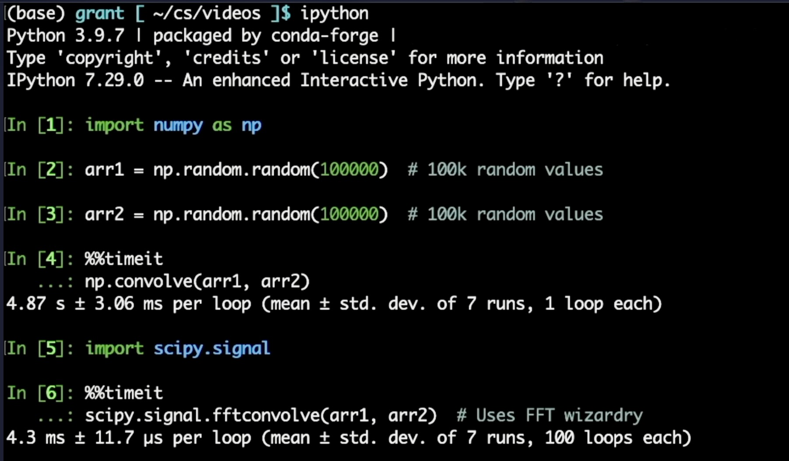

---

## Hardware vs Software Comparison

### Software Benchmark
The FFT accelerator was compared with Python-based convolution.

- Direct convolution (NumPy): ≈ 4.87 s  
- FFT-based convolution (SciPy): ≈ 4.3 ms  

The hardware accelerator achieves additional speedup due to:
- Parallelism  
- Streaming  
- Dedicated datapath  

Latency ≈ **27.5 ns**, demonstrating the benefits of hardware acceleration.

---

## Important Insight
The simulation finish time represents total runtime including idle cycles and multiple testbench runs.  
Measured latency reflects only active processing and indicates the true efficiency of the architecture.

---

## Applications
- Wireless communication  
- Real-time DSP  
- AI accelerators  
- Software-defined radio  
- Edge computing  
- Image and audio processing  

---

## Future Work
- ASIC implementation and PPA optimization  
- Integration with AXI-based SoC  
- Support for larger FFT sizes  
- Low-power optimization  
- Hardware/software co-design  

---

## Repository Structure
