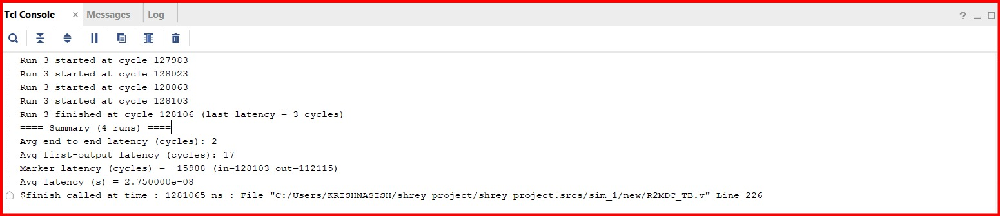
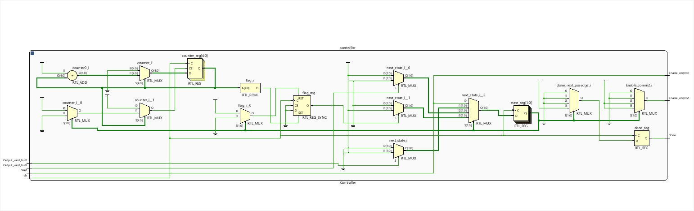
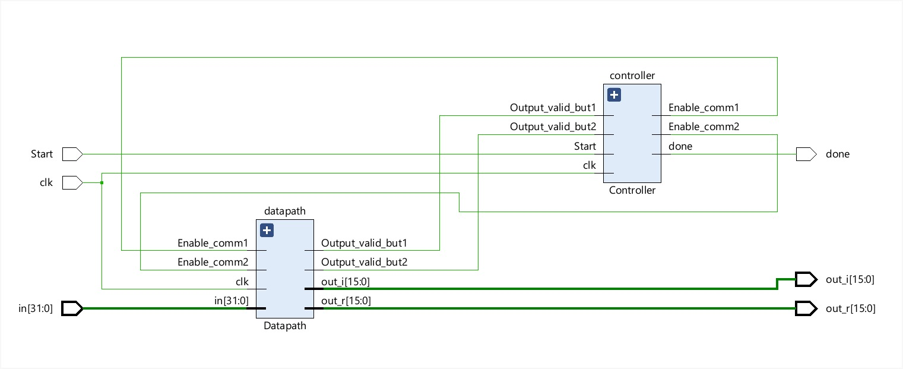

# R4MDC FFT Hardware Accelerator

## Overview
This project implements a high-throughput Fast Fourier Transform (FFT) hardware accelerator using the Radix-4 Multi-Delay-Commutator (R4MDC) architecture in Verilog HDL. The design targets real-time DSP and AI workloads with a focus on pipelined processing, low latency, and high throughput.

The accelerator is fully parameterized and designed for FPGA/ASIC scalability with cycle-accurate verification and performance evaluation.

---

## Key Features
- Radix-4 Multi-Delay-Commutator FFT architecture  
- Streaming datapath with continuous input-output flow  
- Fully pipelined butterfly and complex multiplication units  
- Fixed-point arithmetic with configurable precision  
- FPGA-friendly and scalable microarchitecture  
- Hardware vs software performance comparison  

---

## Architecture Overview

### Block Diagram

The R4MDC architecture exploits parallelism and pipelining to achieve high throughput. Each stage performs butterfly operations followed by commutation for streaming data flow.

---

## Core Modules
The design is modular and includes:

- `R4MDC_Top.v` – Top-level integration  
- `Datapath.v` – Streaming datapath  
- `Controller.v` – FSM-based control logic  
- `Butterfly.v` – Radix-4 butterfly unit  
- `Complex_Mult.v` – Twiddle multiplication  
- `Commutator_In.v` – Input data permutation  
- `Commutator_Out.v` – Output reordering  
- `Memory_Twiddle_Factor.v` – Twiddle storage  
- `Safe_Scale.v` – Fixed-point scaling  
- `module0.v` – Supporting module  

---

## Implementation Details

### Fixed-point Format
All modules use a parameterized fixed-point format with configurable word length (`WL`).  
Multipliers produce `2 × WL` intermediate results, and the Safe Scale block aligns outputs back to `WL` using rounding and saturation.

---

### Pipelining Strategy
- Butterfly and complex multipliers are pipelined to achieve high operating frequency.
- The pipeline supports clock frequencies between **100–250 MHz**, depending on FPGA and synthesis.
- The controller compensates for pipeline latency when asserting valid and done signals.

---

### Data Reordering
The R4MDC architecture requires data permutation between stages.  
This is implemented using commutator blocks with:
- Shift registers  
- SRAM buffers  
- Index-based addressing  

This enables continuous streaming.

---

## Simulation and Verification

A cycle-accurate Verilog testbench was used with randomized inputs to validate correctness and measure performance.

### Testbench Console Output

### Controller Operation

---

## Results

### Schematic

---

### Latency
| Metric | Value |
|------|------|
| Average end-to-end latency | 2 cycles |
| First-output latency | 17 cycles |
| Wall-clock latency | 27.5 ns |
| Operating frequency | 100 MHz |

The first-output latency represents pipeline fill.

---

### Throughput
Throughput ≈ 36.36 M FFT frames/s

---

## Hardware vs Software Comparison

### Software Benchmark
The FFT accelerator was compared with Python-based convolution.

- Direct convolution (NumPy): ≈ 4.87 s  
- FFT-based convolution (SciPy): ≈ 4.3 ms  

The hardware accelerator achieves additional speedup due to:
- Parallelism  
- Streaming  
- Dedicated datapath  

Latency ≈ **27.5 ns**, demonstrating the benefits of hardware acceleration.

---

## Important Insight
The simulation finish time represents total runtime including idle cycles and multiple testbench runs.  
Measured latency reflects only active processing and indicates the true efficiency of the architecture.

---

## Applications
- Wireless communication  
- Real-time DSP  
- AI accelerators  
- Software-defined radio  
- Edge computing  
- Image and audio processing  

---

## Future Work
- ASIC implementation and PPA optimization  
- Integration with AXI-based SoC  
- Support for larger FFT sizes  
- Low-power optimization  
- Hardware/software co-design  

---

## Author
**Shrey Painuli**  
M.Tech, Sensors and Internet of Things  
Indian Institute of Technology Jodhpur
